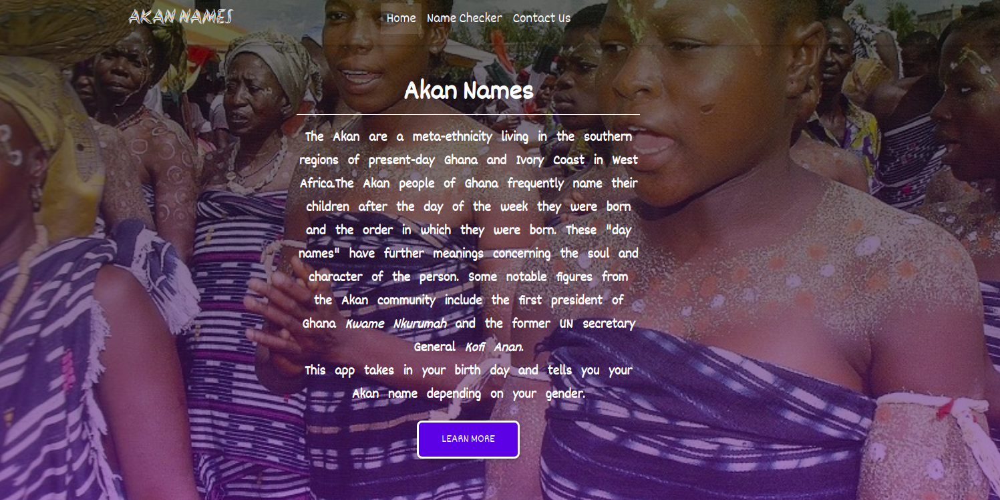
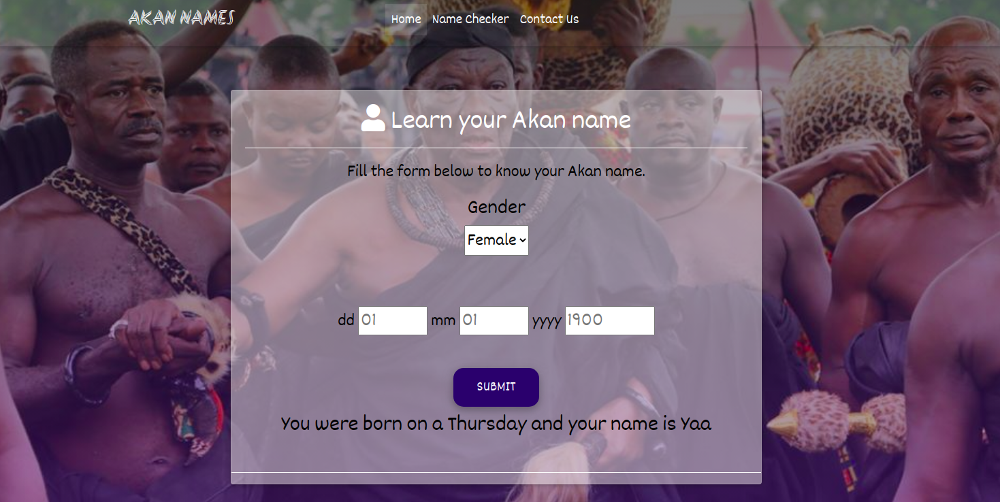

# Akan-Names
### By Dorothy Muhonja

## Description
 This is a web application where the user inputs their gender, birth date, month and year which is then converted to the specific day they were born (Sunday- Saturday) and tells them their Akan name.
 ## Set Up instructions 
### Requirement
* Code Editor i.e Visual Studio/Atom/Notepad
* Chrome web browser

### How To Run
* Click on this [Link](https://github.com/dorothymuhonja/Akan-Names.git) to access my git hub Akan-Names repositpory.
* Fork or Clone the repository
* You can also access the web application directly using this [live link](https://dorothymuhonja.github.io/Akan-Names/).

## BDD(Behavior Driven Development)
* User is required to  select their gender (male or female) and input their birth date(01-31), month (01-12) and year(1900-2020) 
* Users birthday is converted to the day they were born
* The application gives the user their Akan name depending on the day they were born
* When a user inputs the wrong details they get an error message

## Technologies used
* html
* css
* Javascript
* Bootstrap
 
 ## Page Screenshot
 

## Contact information
* Email: dorothymuhonja7@gmail.com

## License and Copyright
Copyright (c) 2020 Dorothy Muhonja

[MIT License](LICENSE)
